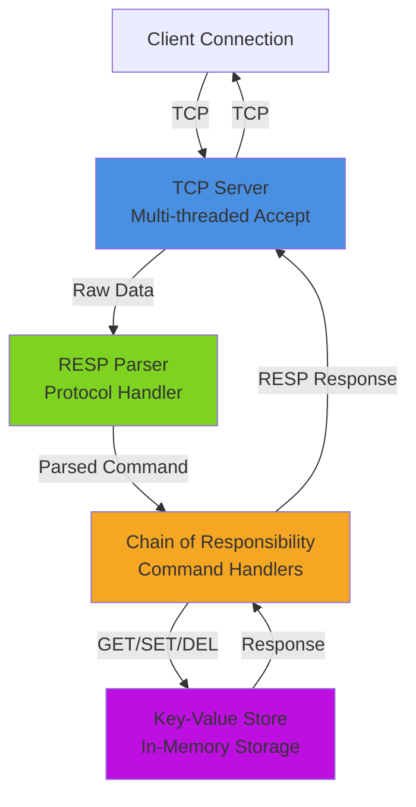
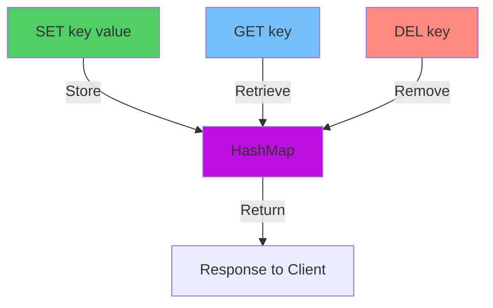

# Ridics

A modern Redis-like in-memory cache server written in C++20, featuring multi-threaded request parsing, a chain-of-responsibility pattern for command handling, and comprehensive testing with Google Test.

## Vision

Ridics aims to build a Redis server from scratch following the [Build Your Own Redis](https://build-your-own.org/redis/) tutorial, with a focus on:

- **Modern C++20 design patterns** — Clean abstractions using CRTP, move semantics, and STL.
- **Multi-threaded architecture** — Efficient handling of concurrent client connections.
- **Chain of Responsibility pattern** — Extensible command handler pipeline.
- **Comprehensive testing** — Full coverage with Google Test (gtest).
- **RESP protocol support** — Redis Serialization Protocol parsing and handling.

## Architecture Overview



## Current Status

### ✅ Completed

- TCP server foundation with multi-threaded client handling
- RESP protocol parser for basic types (integers, strings, bulk strings, arrays)
- Google Test integration with proper test isolation
- Safe stream reading primitives (`read_stream`, `write_stream`)
- Thread-safe atomic operations for test synchronization

### 🚧 In Progress

- RESP server handshake implementation
- Error handling and validation

## Upcoming Goals

### Phase 1: Testing Improvements
- [ ] Increase test coverage for edge cases
- [ ] Add integration tests for multi-client scenarios
- [ ] Performance benchmarks for parsing and I/O
- [ ] Stress tests for concurrent connections

### Phase 2: Chain of Responsibility Pattern
- [ ] Implement command handler interface
- [ ] Build handler pipeline architecture
- [ ] Support for extensible custom handlers
- [ ] Error handling and fallthrough mechanisms

```mermaid
graph LR
    CMD["Parsed Command"]
    H1["Auth Handler"]
    H2["Validation Handler"]
    H3["Command Executor"]
    H4["Response Formatter"]
    RESP["RESP Response"]
    
    CMD -->|canHandle?| H1
    H1 -->|yes| H1Process["Process Auth"]
    H1Process --> H2
    H1 -->|no| H2
    
    H2 -->|canHandle?| H2Process["Validate Command"]
    H2Process --> H3
    H2 -->|no| H3
    
    H3 -->|canHandle?| H3Process["Execute"]
    H3Process --> H4
    H3 -->|no| H4
    
    H4 -->|Format| RESP

    style H1 fill:#FF6B6B
    style H2 fill:#4ECDC4
    style H3 fill:#45B7D1
    style H4 fill:#FFA07A
```



### Phase 3: Key-Value Storage & Operations
- [ ] Implement in-memory hash map storage
- [ ] Support GET, SET, DEL commands
- [ ] Implement key expiration (TTL)
- [ ] Support various data types (strings, lists, sets, hashes)
- [ ] Persistence layer (RDB/AOF)



## Building

### Prerequisites

- C++20-capable compiler (GCC 10+, Clang 10+)
- CMake 3.20+
- Google Test (optional, auto-discovered)

### Build Steps

```sh
mkdir -p build
cd build
cmake .. -DCMAKE_BUILD_TYPE=Release
cmake --build . -j$(nproc)
```

### Run Tests

```sh
ctest --output-on-failure
# or run directly
./tests/test_runner
```

### Run Server

```sh
./ridics
```

## Design Patterns

### CRTP (Curiously Recurring Template Pattern)

The `TCPServer` base class uses CRTP to provide compile-time polymorphism:

```cpp
template<typename Derived, typename Err, typename... Types>
class TCPServer {
    // ...
};

class TCPServerBasic : public TCPServer<TCPServerBasic, TCPError, std::string> {
    // ...
};
```

### Variant for Error Handling

Command handlers return `std::variant<Error, Result>` for type-safe error handling:

```cpp
std::variant<RESPError, std::unique_ptr<data::Node>> 
read_int(int connfd, char* body, int& i);
```

### Move Semantics

All callbacks use rvalue references to efficiently move non-copyable types (like `unique_ptr`):

```cpp
using worker_t = std::function<void(int, std::variant<Err, Types...>&&)>;
```

## Testing Strategy

### Test Isolation

Each test suite has its own server instance with proper setup/teardown:

```cpp
class RESPTest : public testing::Test {
    void SetUp() override;    // Start server
    void TearDown() override; // Gracefully shutdown
};
```

### Thread Synchronization

Atomic flags ensure proper server lifecycle management:

```cpp
std::atomic<bool> server_ready{false};
std::atomic<bool> server_shutdown{false};
```

## Contributing

When adding new features:

1. Write tests first (TDD approach)
2. Implement the feature following C++20 best practices
3. Ensure all tests pass: `ctest --output-on-failure`
4. Update this README with new capabilities

## License

MIT License — See LICENSE file for details.

## References

- [Build Your Own Redis](https://build-your-own.org/redis/)
- [Redis Protocol (RESP)](https://redis.io/docs/reference/protocol-spec/)
- [Modern C++20 Features](https://en.cppreference.com/w/cpp/20)
- [Google Test Documentation](https://google.github.io/googletest/)

---

**Status**: Early development — Currently implementing Phase 1 (Testing) and Phase 2 (Chain of Responsibility)

